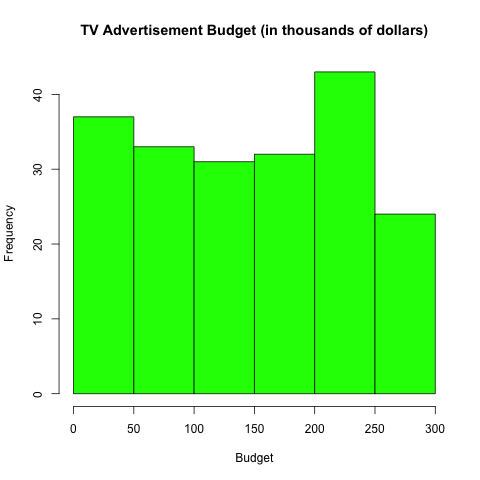
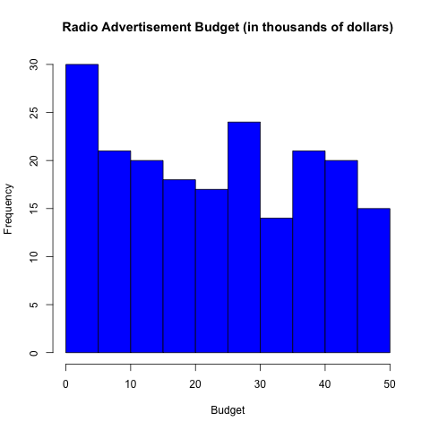
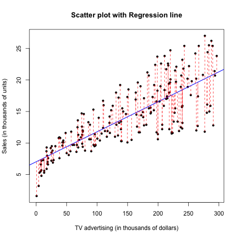
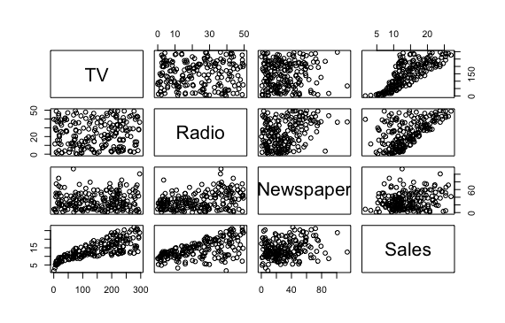
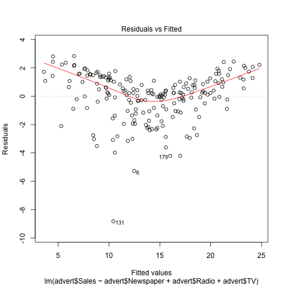
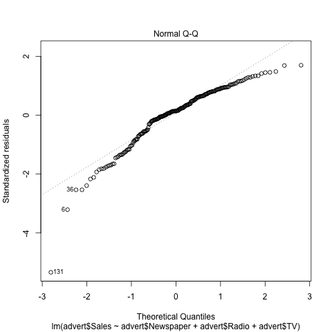
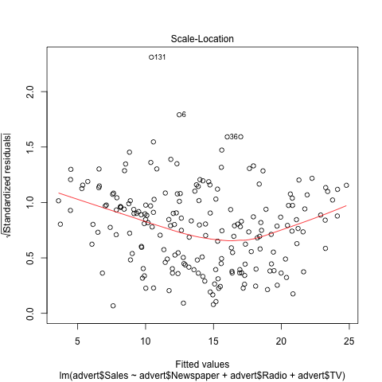

# Abstract

This report will replicate the main results displayed in section 3.2 **Multiple Linear Regression** (chapter 3) of the book *An Introduction to Statistical Learning*.

# Introduction

The primary goal of this analysis is to give advice on how to boost sales of the  product given the current information on advetising budgets. More specifically, the idea is to determine whether there exists an correalation between advertising and sales, and if so, formulate an accurate model that can be used to predict sales from media budget. For this analysis in particular, a combination of simple linear regression and multiple linear regression.

# Data

The Advertising data set comprises of the Sales (in thousands of units) in 200 different markets, along with the advertising budgets (in thousands of dollars)  in each market for three different forms of media: TV, Radio, and Newspaper. In this report, the relation between each of them and Sales, and the possible relation between Sales and the three of them combined are observed and studied/analyzed.

We may first look at the table of summary statistics below:

```{r,echo=FALSE, results='asis',message=FALSE}
advert <- read.csv('http://www-bcf.usc.edu/~gareth/ISL/Advertising.csv')
library(xtable)
print(xtable(summary(advert[2:5]), caption = "Summary Statistics"), comment = FALSE)
```

Histograms for each variable: 






\newpage

# Methodology

## Single Linear Regression

We consider each media separately from the data set - TV, Radio and Newspaper - and study its relationship with the dependent variable Sales. The null hypothesis is that each of the independent variables would not have an effect on Sales, and the alternate hypothesis suggests otherwise. Thus a linear model is generated:

$$Sales = \beta_{0} + \beta_{1} (TV / Radio / Newspaper)$$

## Multiple Linear Regression

It would be a better approach to expand the model of Sales with multiple predictors rather than single predictors each time, avoiding an excess of linear models. This is done by accomodating each predictor with their respective slope coefficient in a single model. Thus the multiple linear regression model takes the form:

$$Sales = \beta_{0} + \beta_{1}TV + \beta_{2}Radio + \beta_{3}Newspaper$$

# Results 

## Single Linear Regression

Using `lm()` to fit the data into a simple linear model, the regression coefficients are as follows:

```{r,echo=FALSE, results='asis',message=FALSE}
advert <- read.csv('http://www-bcf.usc.edu/~gareth/ISL/Advertising.csv')
library(xtable)
print(xtable(lm(advert$Sales ~ advert$TV), caption = "Regression Coefficents for TV~Sales"), comment = FALSE)
```

```{r,echo=FALSE, results='asis',message=FALSE}
advert <- read.csv('http://www-bcf.usc.edu/~gareth/ISL/Advertising.csv')
library(xtable)
print(xtable(lm(advert$Sales ~ advert$Radio), caption = "Regression Coefficents for TV~Radio"), comment = FALSE)
```

```{r,echo=FALSE, results='asis',message=FALSE}
advert <- read.csv('http://www-bcf.usc.edu/~gareth/ISL/Advertising.csv')
library(xtable)
print(xtable(lm(advert$Sales ~ advert$Newspaper), caption = "Regression Coefficents for TV~Newspaper"), comment = FALSE)
```

The scatterplots with their respective regression lines are as follows:




Quality Indices calculated with the regression analysis are as follows:

```{r,echo=FALSE, results='asis',message=FALSE}
source('../code/functions/regression-functions.R')
TV.Table = matrix(nrow = 3, ncol = 2)
Quantity = c("RSE", "R^2", "F-statistic")
TV.Value = c(residual_std_error(lm(advert$Sales ~ advert$TV)), r_squared(lm(advert$Sales ~ advert$TV)), f_statistic(lm(advert$Sales ~ advert$TV)))
TV.Table[,1] = Quantity
TV.Table[,2] = TV.Value
colnames(TV.Table) = c('Quantity', 'Value')
print(xtable(TV.Table, caption = "Quality Indices of Regression of Sales and TV"), comment = FALSE)
```

In the case of TV, the p-value is below 0.05 and the RSE and R^2 values are relatively small. This is reason enough to reject the null hypothesis and establish that TV advertising does impact Sales in a positive, linear correlation (as can be seen in the graph).

```{r,echo=FALSE, results='asis',message=FALSE}
source('../code/functions/regression-functions.R')
Radio.Table = matrix(nrow = 3, ncol = 2)
Quantity = c("RSE", "R^2", "F-statistic")
Radio.Value = c(residual_std_error(lm(advert$Sales ~ advert$Radio)), r_squared(lm(advert$Sales ~ advert$Radio)), f_statistic(lm(advert$Sales ~ advert$Radio)))
Radio.Table[,1] = Quantity
Radio.Table[,2] = Radio.Value
colnames(Radio.Table) = c('Quantity', 'Value')
print(xtable(Radio.Table, caption = "Quality Indices of Regression of Sales and Radio"), comment = FALSE)
```

Radio advertising budgets too have a similar impact on Sales, although from comparing 
the two scatter plots, Radio's linear regression is not as accurate as that of TV's.

```{r,echo=FALSE, results='asis',message=FALSE}
source('../code/functions/regression-functions.R')
News.Table = matrix(nrow = 3, ncol = 2)
Quantity = c("RSE", "R^2", "F-statistic")
News.Value = c(residual_std_error(lm(advert$Sales ~ advert$Newspaper)), r_squared(lm(advert$Sales ~ advert$Newspaper)), f_statistic(lm(advert$Sales ~ advert$Newspaper)))
News.Table[,1] = Quantity
News.Table[,2] = News.Value
colnames(TV.Table) = c('Quantity', 'Value')
print(xtable(News.Table, caption = "Quality Indices of Regression of Sales and Newspaper"), comment = FALSE)
```

The same can be said about Newspaper, for the most part. The RSE value is large than that of TV, suggesting that the linear model is not the best fit necessarily. Nevertheless, the low p-value (statistical significance) allows the the null hypothesis to be rejected. 

## Multiple Regression Analysis

Fitting all 4 variables to a simple linear regression model, the regression coefficients are calculated:

```{r,echo=FALSE,results='asis',message=FALSE,fig.align='center'}
advert <- read.csv('http://www-bcf.usc.edu/~gareth/ISL/Advertising.csv')
library(xtable)
print(xtable(lm(advert$Sales ~ advert$TV + advert$Radio + advert$Newspaper), caption = 'Simple regression of Sales on Newspaper, TV and Radio'), comment = FALSE)
```

From this table we see that the p-value for Newspaper is not smaller than 0.05 and compartively larger than TV and Radio. Hence, Newspaper advertising budget, in relation to Sales, is not statistically significant. 

The correlation matrix is as follows:

```{r,echo=FALSE,results='asis',message=FALSE,fig.align='center'}
advert <- read.csv('http://www-bcf.usc.edu/~gareth/ISL/Advertising.csv')
library(xtable)
print(xtable(cor(advert[2:5]), caption = 'Correlation Matrix for Sales on Newspaper, TV and Radio'), comment = FALSE)
```

Studying this correlation matrix, keeping in mind that Newspaper advertising is not statistically significant, it is observed that TV has low correlation with Radio and Newspaper, while having a high correlation value with TV. This suggests that TV has a strong impact on Sales while Radio and Newspaper perform differntly but equally different. Newspaper has the lowest correlation value with Sales, indicating that Newspaper have the least impact on Sales. 

Finally, the matrix of coefficients can be distributed on a scatter plot:



The plots reinforce the conclusions made for the correlation matrix. 


The Quality Indices for the Multiple Linear Regression are:

```{r,echo=FALSE, results='asis',message=FALSE}
source('../code/functions/regression-functions.R')
All.Table = matrix(nrow = 3, ncol = 2)
Quantity = c("RSE", "R^2", "F-statistic")
All.Value = c(residual_std_error(lm(advert$Sales ~ advert$Newspaper+advert$TV+advert$Radio)), r_squared(lm(advert$Sales ~ advert$Newspaper+advert$TV+advert$Radio)), f_statistic(lm(advert$Sales ~ advert$Newspaper+advert$TV+advert$Radio)))
All.Table[,1] = Quantity
All.Table[,2] = All.Value
colnames(TV.Table) = c('Quantity', 'Value')
print(xtable(All.Table, caption = "Quality Indices of the Multiple Linear Regression of Sales and Newspaper, TV and Radio"), comment = FALSE)
```

The RSE and the R^{2} value are low, significantly lower than the values computed in any of the 3 single linear regressions. This suggests that the multiple regression analysis create a linear model that is a relatively and comparatively good for for the data. 

\newpage

3 more plots can represent the relationship between Sales and the 3 media outlets: 





\newpage

# Conclusions

In conclusion, the multiple linear regression is more accurate than the single linear regressions. From the tables above (`F-statistic`) from multiple regression, at the very least one of the predictors can be used to predict `Sales`. Nevertheless, we also find that not all of the predictors are statistically significant (from the p-values). Hence, the prediction would be more accurate if the `newspaper` budget is not avoided based on its corresponding p-value. Other indicators, including Residual Standarnd Error, R^{2} and F-statistic, also comment on the fit of the linear model - the smaller these vaules/statistics or approaching 0, the more accurately the model represents the data.
 

